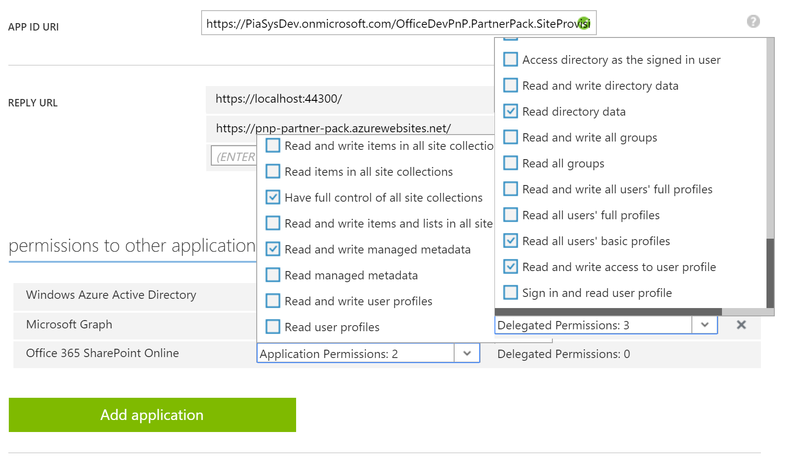

# PnP Partner Pack - Upgrade Guide from v. 1.0 to v. 2.0 

## Version overview
In the following list, you can find some new capabilities and some minor fixes that
were introduced with the PnP Partner Pack v. 1.1 (February 2016) or 2.0 (September 2016):
* Added the capability to consume the Microsoft Graph API, so far to show the currently
logged-in user's photo. Much more capabilities will come in the near future.
* Updated to use the latest CSOM package (16.1.5626.1200) and the latest PnP Core Library
 package (2.7.1609.2)
* Updated to use the latest versions of NuGet packages, to avoid deployment issues
* Updated and improved quality of documentation
* New Governance functionalities
* Support for .PNP Open XML template files
* Support for PnP Templates Gallery
* Improved error handling
* Fixed some issues and bugs

This document is about how to upgrade from the **PnP Partner Pack v. 1.0 (October 2015)**
to the **PnP Partner Pack v. 2.0 (September 2016)**.

Notice that the UI based desktop Setup application (for Windows OS only) that will be released pretty soon, will also provide the capability to upgrade an already installed version of the PnP Partner Pack.

## Upgrade Steps
In order to upgrade to the v. 2.0 of the PnP Partner Pack you will simply need to:
* Pull the updated source code from the GitHub repository, consuming the <a href="https://github.com/OfficeDev/PnP-Partner-Pack">master branch</a>
* Download all the required and updated NuGet packages at the solution level, for all the projects included in the solution
* Update the .config files of the projects defined in the solution by using the
<a href="../scripts/Configure-Configs.ps1">Configure-Configs.ps1</a> PowerShell script file
that is available in the 
<a href="../scripts/">Scripts folder</a> of this repository. This PowerShell script requires some input arguments, which are:
    * AzureStorageAccountName: the name of the storage account that will be used the infrastructural services and by the job
    * AzureStoragePrimaryAccessKey: the access key to consume the Azure Storage Account
    * ClientId: the OAuth ClientID registered in Azure AD for the PnP Partner Pack application 
    * ClientSecret: the OAuth Client Secret registered in Azure AD for the PnP Partner Pack application 
    * ADTenant: the tenant name of the target Microsoft Office 365 tenant (something like: tenant.onmicrosoft.com)
    * CertificateThumbprint: the thumbprint of the X.509 certificate that will be used for App-Only authentication
    * InfrastructureSiteUrl: the URL of the SharePoint Online infrastructural Site Collection for the PnP Partner Pack 
* Refresh the publishing on Microsoft Azure of the PnP Partner Pack web application (OfficeDevPnP.PartnerPack.SiteProvisioning) and of the two related Azure Web Jobs (OfficeDevPnP.PartnerPack.ContinousJob and OfficeDevPnP.PartnerPack.ScheduledJob).
* Update the permissions for the application in Azure Active Directory, accordingly to the following list of permissions:
    * Office 365 SharePoint Online (Application Permission)
        * Have full control of all site collection
        * Read and write managed metadata
    * Microsoft Graph (Delegated Permission) (**New**)
        * Read and write access to user profile
        * Read directory data
        * Read all users' basic profiles
    * Windows Azure Active Directory (Delegated Permission) (**New**)
        * Sign in and read user profile
* Ensure the application in Azure Active Directory has reply URL(s) that have a trailing slash (/)
* Refresh the templates applied to the Infrastructure Site Collection, by executing the <a href="../scripts/Provision-InfrastructureSiteArtifacts.ps1">**Provision-InfrastructureSiteArtifacts.ps1**</a> PowerShell script file that is available in the <a href="../scripts/">Scripts folder</a> of this repository

For further details about how to configure the permissions, see the following figure.

Enjoy the refresh PnP Partner Pack v. 2.0!